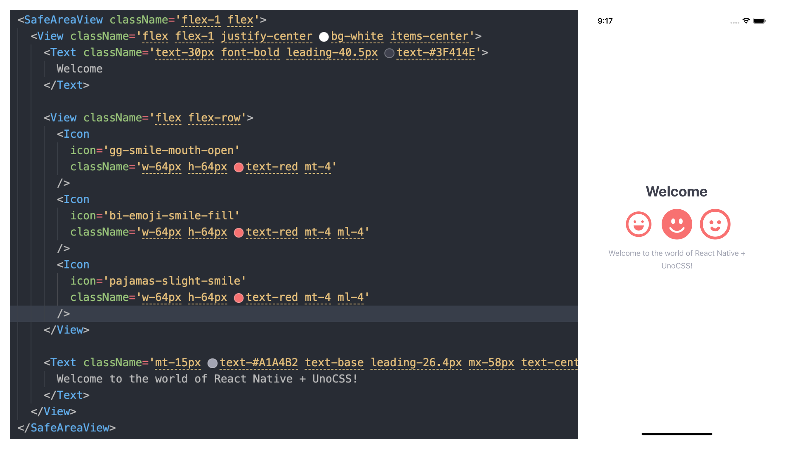

# Uno With React Native
Using UnoCSS in a React Native project [Demo](https://github.com/eagermko/unonative-demo)



## Setup

```bash
yarn add unonative
```

### Basic setup


1. Uno Config for vscode plugin auto completion

```ts
// uno.config.ts
import { defineConfig } from 'unocss';
import { preset } from 'unonative/preset';

export default defineConfig({
  presets: [...preset],
});
```

2. Transform JsxElement with className to Wrapper
```js
// babel.config.js
// npm i babel-plugin-jsx-classlist
const unocssBabel = require('unonative/babel');

module.exports = function(api) {
  api.cache(true);
  return {
    presets: ['babel-preset-expo'],
    plugins: [unocssBabel.default],
  };
};

```

3. Due to Babel Visitor **not supporting** asynchronous processing of source code, we have moved the processing of style collection/Icon to Metro transformer.
```js
// metro.config.js
// Learn more https://docs.expo.io/guides/customizing-metro
const { getDefaultConfig } = require('expo/metro-config');

const config = getDefaultConfig(__dirname);


const babelTransformerPath = require.resolve('unonative/transformer');
config.transformer.babelTransformerPath = babelTransformerPath;
module.exports = config;

```

### Enable SVG icon support (**optional**)
```bash
expo install react-native-svg
yarn add @iconify/json
```
After importing the dependencies, you can use them in your project.
```tsx
import { Icon } from 'unonative';

export function App() {
  return <View>
    <Icon icon="cib-addthis" className="w-32px h-32px text-red-100" />
  </View>  
}
```
Icons can be sourced from [icones](https://icones.js.org/) using the format "**collection**-(icon)".

### Use with Typescript
```diff
// project .d.ts
+/// <reference types="unonative/type" />
```

## How it works

**Source Code**

```tsx
import { Icon } from 'unonative';
function App() {
  return (
    <View className='bg-red-100'>
      <Text className='text-lg'>Hello</Text>
      <Text className='text-lg'>Word</Text>
      <Icon icon='cib-addthis' className='h-8 w-8' />
		</View>
	);
}
```

In the Metro Transform phase, the source code will be processed into

```tsx
import __unonative__ from 'unonative';
import { Icon } from 'unonative';
function App() {
  return (
    <View className='bg-red-100'>
      <Text className='text-lg'>Hello</Text>
      <Text className='text-lg'>Word</Text>
      <Icon
        icon='<svg viewBox="0 0 32 32" width="1em" height="1em" ><path fill="currentColor" d="M24 17.995h-6v5.979h-4v-5.979H8v-3.984h6V8.027h4v5.984h6zM28 .052H4a4.008 4.008 0 0 0-4 3.99v23.922a4.007 4.007 0 0 0 4 3.984h24a4.007 4.007 0 0 0 4-3.984V4.042a4.01 4.01 0 0 0-4-3.99z"/></svg>'
        className='h-8 w-8'
      />
    </View>
  );
}
__unonative__.register({
  'bg-red-100': { backgroundColor: 'rgba(254,226,226,1)' },
  'text-lg': { fontSize: 18 },
  'h-8': { height: 32 },
  'w-8': { width: 32 },
});
```

In the Babel transpile phase, any jsxElement containing className will be transpiled into a **higher-order component**

```tsx
import { UnoStyled as _UnoStyled } from "unonative";
import __unonative__ from "unonative";
import { Icon } from 'unonative';
function App() {
  return <_UnoStyled className='bg-red-100' component={View}>
     <_UnoStyled className='text-lg' component={Text}>Hello</_UnoStyled>
     <_UnoStyled className='text-lg' component={Text}>Word</_UnoStyled>
     <_UnoStyled icon='<svg viewBox="0 0 32 32" width="1em" height="1em" ><path fill="currentColor" d="M24 17.995h-6v5.979h-4v-5.979H8v-3.984h6V8.027h4v5.984h6zM28 .052H4a4.008 4.008 0 0 0-4 3.99v23.922a4.007 4.007 0 0 0 4 3.984h24a4.007 4.007 0 0 0 4-3.984V4.042a4.01 4.01 0 0 0-4-3.99z"/></svg>' className='h-8 w-8' component={Icon} />
                </_UnoStyled>;
}
__unonative__.register({
  "bg-red-100": {
    "backgroundColor": "rgba(254,226,226,1)"
  },
  "text-lg": {
    "fontSize": 18
  },
  "h-8": {
    "height": 32
  },
  "w-8": {
    "width": 32
  }
});
```

## Demo

[unonative-demo](https://github.com/eagermko/unonative-demo)

## Roadmap

- [x] Exporting type definitions
- [ ] Adding a VW preset to convert PX units to VW units
- [x] Generating CSS using uno.config.ts at the project root path
